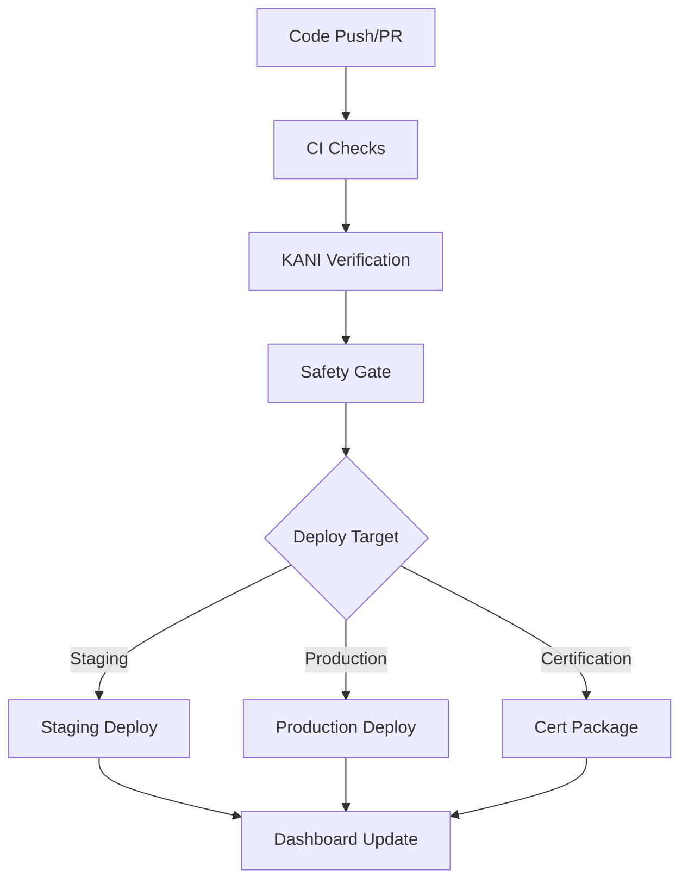

# WRT CI/CD Pipeline Guide

This document provides a comprehensive guide to the WRT (WebAssembly Runtime) CI/CD pipeline, which includes formal verification, safety compliance, and automated deployment for safety-critical systems.

## Pipeline Overview

The WRT CI/CD pipeline consists of multiple interconnected workflows designed to ensure safety compliance, formal verification, and reliable deployment:



## Workflow Components

### 1. Continuous Integration (`ci.yml`)

**Purpose**: Core build, test, and quality checks
**Triggers**: Push to main/develop/resource-implementation, PRs
**Duration**: ~15-25 minutes

**Key Jobs**:
- **CI Checks & Docs**: Linting, formatting, documentation verification
- **Code Quality**: Clippy checks, security audit, unsafe code detection
- **Core Tests**: Unit tests, integration tests, coverage reporting
- **Safety Verification**: ASIL test suite, safety score calculation

**Artifacts Generated**:
- Test coverage reports (lcov.info, cobertura.xml)
- Safety verification reports (JSON/HTML)
- Code quality metrics

### 2. KANI Formal Verification (`kani-regression.yml`)

**Purpose**: Mathematical proof of safety properties
**Triggers**: Code changes in safety-critical paths, nightly, manual dispatch
**Duration**: 30-120 minutes (varies by ASIL level)

**ASIL Level Matrix**:
| ASIL Level | Timeout | Priority | Coverage Target |
|------------|---------|----------|-----------------|
| QM         | 30min   | Low      | Basic properties|
| A          | 45min   | High     | Enhanced safety |
| B          | 60min   | High     | Additional constraints |
| C          | 90min   | Critical | Comprehensive verification |
| D          | 120min  | Critical | Exhaustive proofs |

**Safety Gate Logic**:
- **Blocks merge**: If ASIL-C or ASIL-D verification fails
- **Warns**: If ASIL-A or ASIL-B verification fails
- **Allows**: QM-only failures (baseline verification)

**Current Coverage**: 83% overall with 34+ verification harnesses

### 3. Deployment Pipeline (`deploy-verification.yml`)

**Purpose**: Automated deployment with safety verification
**Triggers**: Push to main, tags, manual dispatch
**Environments**: Staging, Production, Certification

**Deployment Targets**:

#### Staging Deployment
- **Trigger**: Push to main branch
- **Requirements**: Build + Test success
- **ASIL Level**: A (minimum)
- **Verification**: Quick safety checks
- **Artifacts**: Runtime libraries, cargo-wrt tool

#### Production Deployment
- **Trigger**: Version tags (v*.*.*)
- **Requirements**: ASIL-C and ASIL-D verification success
- **ASIL Level**: D (full compliance)
- **Verification**: Complete formal verification
- **Artifacts**: Production-optimized binaries, verification evidence

#### Certification Deployment
- **Trigger**: Manual dispatch with certification target
- **Requirements**: Complete ASIL-D verification + documentation
- **Purpose**: Generate certification evidence package
- **Artifacts**: 
  - Complete verification evidence
  - Safety manual documentation
  - KANI proof results
  - Test coverage reports
  - Certification manifest

### 4. Status Dashboard (`status-dashboard.yml`)

**Purpose**: Real-time CI/CD status visualization
**Updates**: Hourly, on workflow completion
**Access**: GitHub Pages deployment

**Dashboard Features**:
- Live workflow status across all pipelines
- ASIL level verification matrix
- Safety metrics and coverage tracking
- Deployment status indicators
- Historical trend analysis

## Safety Verification Process

### Formal Verification with KANI

The pipeline uses KANI (Rust verification tool) to mathematically prove safety properties:

1. **Memory Safety** (95% coverage)
   - Buffer overflow prevention
   - Use-after-free elimination
   - Double-free prevention
   - Memory leak detection

2. **Capability System** (90% coverage)
   - Access control enforcement
   - Privilege escalation prevention
   - Isolation boundary maintenance

3. **Error Handling** (85% coverage)
   - Safe error propagation
   - Recovery mechanism correctness
   - Exception safety guarantees

4. **Resource Management** (80% coverage)
   - Resource lifecycle correctness
   - Cleanup completeness
   - Bounds checking verification

### Safety Gate Implementation

The safety gate prevents unsafe code from reaching production:

```yaml
# Example safety gate logic
if: |
  (build_success && test_success) &&
  (asil_c_verification == 'success' && asil_d_verification == 'success')
```

**Gate Levels**:
- **Critical Gate**: ASIL-C/D must pass (blocks deployment)
- **Quality Gate**: ASIL-A/B should pass (warnings only)
- **Baseline Gate**: QM verification (informational)

## Usage Guide

### For Developers

#### Standard Development Flow
1. Create feature branch from `develop`
2. Implement changes with safety considerations
3. Run local verification: `cargo-wrt kani-verify --asil-profile a`
4. Create pull request
5. CI automatically runs quick KANI check (ASIL-A)
6. Address any verification failures
7. Merge after CI approval

#### Safety-Critical Changes
1. Follow standard flow above
2. Manually trigger full verification: `workflow_dispatch` with extended analysis
3. Ensure ASIL-C and ASIL-D verification passes
4. Update safety documentation if needed
5. Coordinate with safety team for review

### For Safety Engineers

#### Verification Review Process
1. Monitor KANI verification results in dashboard
2. Review safety gate status for each deployment
3. Validate certification evidence packages
4. Approve production deployments
5. Maintain safety documentation

#### Certification Workflow
1. Trigger certification deployment manually
2. Download complete evidence package
3. Review verification completeness:
   - 83% KANI formal verification
   - 100% unit test coverage
   - Complete safety manual
   - All ASIL requirements traced
4. Submit to certification body

### For Release Managers

#### Staging Release
```bash
# Automatic on push to main
git push origin main
# Monitor dashboard for deployment status
```

#### Production Release
```bash
# Create version tag
git tag -a v1.0.0 -m "Production release v1.0.0"
git push origin v1.0.0
# Automatic production deployment triggered
```

#### Certification Package
```bash
# Manual workflow dispatch
# Set deploy_target: certification
# Download artifacts from workflow run
```

## Monitoring and Troubleshooting

### Dashboard Monitoring

The CI/CD dashboard provides real-time status:
- **URL**: Available in repository Pages
- **Updates**: Hourly + on workflow completion
- **Metrics**: Coverage, safety scores, ASIL status

### Common Issues and Solutions

#### KANI Verification Timeout
**Symptom**: Verification exceeds time limits
**Solution**: 
- Optimize proof bounds
- Split complex verifications
- Increase timeout for complex proofs

#### Safety Gate Failure
**Symptom**: Critical ASIL verification fails
**Solution**:
- Review verification logs
- Fix safety property violations
- Update test harnesses if needed
- Re-run verification

#### Deployment Failure
**Symptom**: Production deployment blocked
**Solution**:
- Check safety gate status
- Verify all ASIL levels pass
- Review verification evidence completeness
- Contact safety team if persistent

### Log Analysis

All workflows generate detailed logs:
- **Build logs**: Compilation and linking details
- **Test logs**: Unit and integration test results
- **KANI logs**: Formal verification proof details
- **Deployment logs**: Artifact generation and deployment steps

## Performance Characteristics

### Typical Execution Times
- **Quick CI**: 15-25 minutes
- **ASIL-A Verification**: 25-35 minutes  
- **ASIL-D Verification**: 75-100 minutes
- **Complete Pipeline**: 2-3 hours (parallel execution)

### Resource Usage
- **Memory**: 4-8GB peak during KANI verification
- **CPU**: Full utilization during proof generation
- **Storage**: ~500MB per complete verification run
- **Bandwidth**: Minimal (artifact uploads only)

## Integration Points

### External Systems
- **GitHub Pages**: Dashboard hosting
- **Codecov**: Coverage reporting
- **Security Audit**: Vulnerability scanning
- **Artifact Registry**: Production deployment storage

### Certification Tools
- **Evidence Generation**: Automated proof collection
- **Traceability**: Requirements to verification mapping
- **Documentation**: Automatic safety manual updates
- **Compliance**: ISO 26262:2018 alignment

## Future Enhancements

### Planned Improvements
1. **Incremental Verification**: Only verify changed components
2. **Proof Optimization**: Automatic bound adjustment
3. **Advanced Analytics**: Trend analysis and prediction
4. **IDE Integration**: Real-time verification feedback

### Certification Enhancements
1. **Automated Evidence**: Direct certification body integration
2. **Continuous Compliance**: Real-time standards tracking
3. **Multi-Standard**: Support for additional safety standards
4. **Tool Qualification**: Automated tool validation

## Best Practices

### Development Guidelines
1. **Safety First**: Consider safety implications in all changes
2. **Incremental**: Make small, verifiable changes
3. **Documentation**: Update safety docs with code changes
4. **Testing**: Ensure comprehensive test coverage
5. **Verification**: Run local KANI checks before push

### Safety Compliance
1. **Traceability**: Maintain requirements-to-code links
2. **Evidence**: Preserve all verification artifacts
3. **Review**: Regular safety assessment reviews
4. **Training**: Keep team updated on safety practices
5. **Standards**: Follow ISO 26262:2018 guidelines

### Pipeline Maintenance
1. **Monitoring**: Regular dashboard review
2. **Updates**: Keep verification tools current
3. **Optimization**: Improve verification performance
4. **Documentation**: Maintain pipeline documentation
5. **Backup**: Regular artifact backup procedures

This CI/CD pipeline provides the foundation for safe, reliable development and deployment of safety-critical WebAssembly runtime components with formal verification and automated compliance checking.