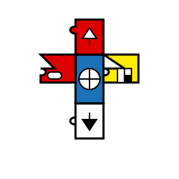

Software Architecture
=====================

.. image:: _static/icons/wrt_architecture.svg
   :width: 64px
   :align: right
   :alt: WRT Architecture Icon

This chapter describes the software architecture of the WRT system. The architecture is designed to meet the requirements specified in the :doc:`requirements` section and the safety requirements in the :doc:`safety_requirements` section.

System Overview
---------------

WRT is a WebAssembly runtime implementation with a focus on bounded execution, bare-metal support, and component model capabilities. The architecture is organized into several key subsystems:

.. spec:: System Component Diagram
   :id: SPEC_001
   :links: REQ_001, REQ_003, REQ_014, REQ_018, REQ_MEM_SAFETY_001, REQ_RESOURCE_001
   
   .. uml:: _static/system_components.puml
      :alt: WRT System Components
      :width: 100%

   The WRT system is comprised of the following main components:
   
   1. Core Runtime - The foundational WebAssembly execution engine
      - Traditional Engine - Stack-based execution engine
      - Stackless Engine - State machine-based execution engine for bounded execution
   2. Component Model - The implementation of WebAssembly Component Model Preview 2
   3. Memory Subsystem - Consolidated memory management system with safety features
   4. Resource Management - Resource tracking and lifecycle management
   5. WASI Interfaces - Platform-specific implementations of WASI APIs
   6. CLI (WRTD) - Command-line interface for running WebAssembly modules
   7. Safety Layer - Cross-cutting safety mechanisms and verifications

Core Runtime Architecture
-------------------------

.. image:: _static/icons/execution_flow.svg
   :width: 48px
   :align: left
   :alt: Execution Flow Icon

The core runtime is responsible for executing WebAssembly instructions and managing the WebAssembly execution environment.

.. spec:: Core Runtime Execution Flow
   :id: SPEC_006
   :links: REQ_001, REQ_003, REQ_007, REQ_RESOURCE_004
   
   .. uml:: _static/component_flow.puml
      :alt: WRT Execution Flow
      :width: 100%
   
   The execution flow demonstrates the bounded execution model, showing how the WRTD CLI interacts with the Engine and how the fuel-based execution can be paused when fuel is exhausted.

.. spec:: Core Runtime Architecture
   :id: SPEC_002
   :links: REQ_001, REQ_003, REQ_005, REQ_006, REQ_007, REQ_MEM_SAFETY_001, REQ_ERROR_003
   
   .. image:: _static/icons/stackless_engine.svg
      :width: 48px
      :align: right
      :alt: Stackless Engine Icon
   
   .. uml:: _static/core_runtime_architecture.puml
      :alt: Core Runtime Architecture
      :width: 100%
   
   The core runtime provides two main interpreter implementations:
   
   1. Traditional Execution Engine - Suitable for most environments
   2. Stackless Execution Engine - Designed specifically for:
      - Bounded execution through fuel metering
      - Resumability after execution pauses
      - No-std compatibility for bare-metal environments
      - State serialization for migration between systems

.. impl:: Engine Implementation
   :id: IMPL_001
   :status: implemented
   :links: SPEC_002, REQ_001, REQ_003, REQ_007, REQ_RESOURCE_004, IMPL_FUEL_001
   
   The ``Engine`` struct is the central execution component that:
   
   1. Manages the WebAssembly state
   2. Tracks fuel consumption
   3. Provides execution control
   4. Contains statistics gathering capabilities
   
   Key methods include:
   - ``set_fuel(amount)`` - Sets the fuel limit for bounded execution
   - ``execute(instance_idx, func_idx, args)`` - Executes a WebAssembly function
   - ``remaining_fuel()`` - Returns the remaining fuel after execution
   - ``stats()`` - Returns execution statistics

.. impl:: Module Implementation
   :id: IMPL_002
   :status: implemented
   :links: SPEC_002, REQ_018, REQ_WASM_001
   
   The ``Module`` struct encapsulates a WebAssembly module and provides:
   
   1. Binary parsing and validation
   2. Type checking
   3. Function table management
   4. Memory management
   
   Key methods include:
   - ``load_from_binary(bytes)`` - Loads a WebAssembly binary
   - ``validate()`` - Validates the module structure and types
   - ``instantiate(engine)`` - Creates a new module instance

.. impl:: Stack Implementation
   :id: IMPL_004
   :status: implemented
   :links: SPEC_002, REQ_005, REQ_RESOURCE_002
   
   The ``Stack`` struct implements a stackless interpreter model:
   
   1. Stores the WebAssembly value stack
   2. Tracks control flow with labels
   3. Enables pausing and resuming execution at any point
   
   This implementation enables bounded execution and state migration.

Memory Subsystem Architecture
-----------------------------

.. image:: _static/icons/memory_management.svg
   :width: 48px
   :align: right
   :alt: Memory Management Icon

The memory subsystem provides a consolidated implementation across the WRT ecosystem with enhanced safety features.

.. spec:: Memory Subsystem Architecture
   :id: SPEC_007
   :links: REQ_018, REQ_023, REQ_024, REQ_MEM_SAFETY_001, REQ_MEM_SAFETY_002, REQ_MEM_SAFETY_003
   
   .. uml:: _static/memory_subsystem.puml
      :alt: Memory Subsystem Architecture
      :width: 100%
   
   The memory subsystem architecture consists of:
   
   1. Centralized memory implementation in ``wrt-runtime::Memory``
   2. Memory operations in ``wrt-instructions::memory_ops``
   3. Consistent memory access across core and component models
   4. Thread-safe memory metrics for profiling and optimization
   5. Comprehensive bounds checking for safety

.. impl:: Memory Implementation
   :id: IMPL_003
   :status: implemented
   :links: SPEC_002, SPEC_007, REQ_018, REQ_023, REQ_024, REQ_MEM_SAFETY_001, IMPL_BOUNDS_001
   
   The enhanced ``Memory`` struct in ``wrt-runtime`` provides a consolidated implementation that:
   
   1. Handles memory allocations and resizing
   2. Enforces memory access boundaries
   3. Provides safe read/write operations
   4. Tracks memory access metrics
   5. Monitors peak memory usage
   6. Supports thread-safe operations
   7. Provides debug name capabilities
   
   Key methods include:
   - ``grow(pages)`` - Grows memory by the specified number of pages
   - ``size()`` - Returns the current memory size in pages
   - ``read/write(addr, data)`` - Safely reads/writes memory with bounds checking
   - ``peak_memory()`` - Returns the peak memory usage during execution
   - ``access_count()`` - Returns the number of memory accesses for profiling
   - ``get_safe_slice()`` - Provides a memory-safe view of a memory region

.. impl:: Memory Operations
   :id: IMPL_011
   :status: implemented
   :links: SPEC_007, REQ_018, REQ_023, REQ_MEM_SAFETY_001, REQ_MEM_SAFETY_003, IMPL_WASM_MEM_001
   
   The ``memory_ops`` module in ``wrt-instructions`` provides:
   
   1. Standardized memory access operations
   2. Implementation of WebAssembly memory instructions
   3. Bounds and alignment checking
   4. Efficient memory load/store operations
   
   Key operations include:
   - ``MemoryLoad`` - Loads values from memory with proper type conversion
   - ``MemoryStore`` - Stores values to memory with proper type conversion
   - ``MemorySize`` - Returns the current memory size
   - ``MemoryGrow`` - Expands the memory by a specified number of pages

Component Model Architecture
----------------------------

The Component Model subsystem implements the WebAssembly Component Model Preview 2 specification with enhanced support for value types and resources.

.. spec:: Component Model Architecture
   :id: SPEC_003
   :links: REQ_014, REQ_019, REQ_020, REQ_021, REQ_RESOURCE_001
   
   .. uml:: _static/component_model.puml
      :alt: Component Model Architecture
      :width: 100%
   
   The Component Model implementation provides:
   
   1. Component instantiation and linking
   2. Interface type conversion
   3. Resource type management
   4. Host function binding
   5. Binary format parsing and validation
   6. Component instance management
   7. Value section encoding/decoding
   8. Name section handling for debugging

.. impl:: Component Implementation
   :id: IMPL_005
   :status: implemented
   :links: SPEC_003, REQ_014, REQ_019, REQ_WASM_001
   
   The ``Component`` struct represents a WebAssembly component:
   
   1. Parses component binary format
   2. Manages component instances
   3. Handles interface binding
   4. Orchestrates resource lifetime
   5. Tracks value consumption for proper validation
   
   Key methods include:
   - ``load_from_binary(bytes)`` - Loads a component binary
   - ``instantiate(engine, imports)`` - Creates a new component instance
   - ``link(other_component)`` - Links two components together

.. impl:: Value Types and Encoding
   :id: IMPL_012
   :status: implemented
   :links: SPEC_003, REQ_014, REQ_019, REQ_021
   
   The value types implementation provides:
   
   1. Complete encoding and decoding of all value types
   2. Support for complex types (records, variants, lists, tuples, flags, enums)
   3. Support for option and result types with proper tag handling
   4. Type validation for encoded values
   5. Efficient serialization and deserialization
   
   This implementation allows for proper representation and manipulation of all value types defined in the Component Model specification.

.. impl:: Interface Type Handling
   :id: IMPL_006
   :status: implemented
   :links: SPEC_003, REQ_014, REQ_019
   
   Interface types are managed through:
   
   1. Type adapters for each interface type
   2. Conversion between host and component types
   3. Validation of type compatibility
   
   The implementation handles interface types including records, variants, enums, flags, and resources.

Resource Management Architecture
-------------------------------

The resource management subsystem handles WebAssembly Component Model resources with proper lifetime management.

.. spec:: Resource Management Architecture
   :id: SPEC_008
   :links: REQ_014, REQ_019, REQ_RESOURCE_001, REQ_RESOURCE_002
   
   .. uml:: _static/resource_management.puml
      :alt: Resource Management Architecture
      :width: 100%
   
   The resource management architecture consists of:
   
   1. Resource type definitions and representations
   2. Resource tables for tracking live resources
   3. Reference counting and lifecycle management
   4. Resource operation handlers (new, drop, rep)
   5. Memory-based resource strategies

.. impl:: Resource Type Handling
   :id: IMPL_010
   :status: implemented
   :links: SPEC_003, SPEC_008, REQ_014, REQ_019, REQ_RESOURCE_001, IMPL_RESOURCE_LIMITS_001
   
   Resource types are implemented through:
   
   1. Reference counting for resource instances
   2. Resource tables for tracking live resources
   3. Host callbacks for resource lifecycle events
   4. Resource dropping semantics
   5. Support for different resource representations (Handle32, Handle64, Record, Aggregate)
   6. Validation for resource operations (new, drop, rep)
   
   Key components:
   - ``Resource`` struct - Represents a component model resource
   - ``ResourceType`` - Type information for resources
   - ``ResourceManager`` - Manages resource instances and lifecycles
   - ``ResourceOperation`` - Represents operations on resources
   - Resource lifetime management functions

Logging Subsystem
-----------------

The logging subsystem implements the WASI logging API and provides platform-specific backends.

.. spec:: Logging Architecture
   :id: SPEC_004
   :links: REQ_015, REQ_016
   
   The logging architecture consists of:
   
   1. WASI logging component interface
   2. Host logging handler registration
   3. Platform-specific backends
   4. Log level filtering and routing
   
   **Logging Flow Sequence**
   
   The following sequence diagram illustrates how logging flows from a WebAssembly module through the runtime:
   
   .. uml:: _static/logging_flow.puml
      :alt: WRT Logging Flow
      :width: 100%
   
   When a WebAssembly module calls a logging function, the following steps occur:
   
   1. WebAssembly module calls the WASI logging interface function (`log`, `logTrace`, etc.)
   2. The WASI logging interface implementation in WRT converts the call to an engine operation
   3. The StacklessEngine creates a LogOperation object with level, message, and optional component ID
   4. The operation is passed to the CallbackRegistry via handle_log()
   5. The CallbackRegistry invokes the registered log handler (if any)
   6. The host logging system (terminal, file, syslog, etc.) processes the log message

.. impl:: Logging Implementation
   :id: IMPL_007
   :status: implemented
   :links: SPEC_004, REQ_015
   
   The logging implementation provides:
   
   1. Standard log levels (Trace, Debug, Info, Warn, Error, Critical)
   2. Registration of custom log handlers
   3. Default stderr fallback
   4. Component-specific context tracking
   
   Key components:
   
   - ``LogLevel`` - Enum with standard log levels (Trace, Debug, Info, Warn, Error, Critical)
   - ``LogOperation`` - Struct containing level, message, and optional component ID
   - ``CallbackRegistry`` - Central registry for handling WebAssembly component operations
   
   Key methods include:
   - ``register_log_handler(handler)`` - Registers a custom log handler
   - ``handle_log(operation)`` - Internal method to process log messages
   - ``LogOperation::with_component(level, message, component_id)`` - Creates a log operation with component context

Safety Architecture
------------------

.. image:: _static/icons/safety_features.svg
   :width: 48px
   :align: left
   :alt: Safety Features Icon

The safety architecture implements cross-cutting safety features that span all WRT subsystems.

.. spec:: Safety Architecture
   :id: SPEC_009
   :links: REQ_MEM_SAFETY_001, REQ_MEM_SAFETY_002, REQ_MEM_SAFETY_003, REQ_RESOURCE_001, REQ_RESOURCE_002, REQ_ERROR_001, REQ_ERROR_003, REQ_VERIFY_001
   
   .. uml:: _static/safety_architecture.puml
      :alt: Safety Architecture
      :width: 100%
   
   The safety architecture consists of:
   
   1. Memory safety mechanisms
   2. Resource limitation controls
   3. Error handling strategies
   4. Verification systems
   5. Code quality assurance processes

.. impl:: Memory Safety Implementations
   :id: IMPL_MEMORY_SAFETY_001
   :status: implemented
   :links: SPEC_009, REQ_MEM_SAFETY_001, REQ_MEM_SAFETY_002, REQ_MEM_SAFETY_003, IMPL_BOUNDS_001, IMPL_SAFE_SLICE_001, IMPL_ADAPTER_001, IMPL_BOUNDS_CHECK_001, IMPL_WASM_MEM_001
   
   Memory safety is ensured through:
   
   1. Comprehensive bounds checking in all memory operations
   2. Safe memory adapters for interfacing with WebAssembly memory
   3. Validation of memory access operations
   4. SafeSlice implementation for memory-safe views

.. impl:: Resource Management Safety
   :id: IMPL_RESOURCE_SAFETY_001
   :status: implemented
   :links: SPEC_009, REQ_RESOURCE_001, REQ_RESOURCE_002, REQ_RESOURCE_003, REQ_RESOURCE_004, REQ_RESOURCE_005, IMPL_LIMITS_001, IMPL_BOUNDED_COLL_001, IMPL_MEM_LIMITS_001, IMPL_FUEL_001
   
   Resource management safety features include:
   
   1. Explicit resource limits for memory, stack, and execution
   2. Bounded collections with capacity limits
   3. Fuel-based execution limiting
   4. Resource exhaustion handling

.. impl:: Error Handling and Recovery
   :id: IMPL_ERROR_HANDLING_RECOVERY_001
   :status: implemented
   :links: SPEC_009, REQ_ERROR_001, REQ_ERROR_002, REQ_ERROR_003, REQ_ERROR_004, REQ_ERROR_005, IMPL_ERROR_HANDLING_001, IMPL_PANIC_HANDLER_001, IMPL_ENGINE_ERR_001, IMPL_RECOVERY_001, IMPL_EXHAUST_HANDLE_001
   
   Error handling and recovery includes:
   
   1. Comprehensive error types and handling
   2. Panic handling with custom hooks
   3. Engine error reporting
   4. Recovery mechanisms for graceful degradation
   5. Resource exhaustion handling

.. impl:: Verification Systems
   :id: IMPL_VERIFICATION_001
   :status: implemented
   :links: SPEC_009, REQ_VERIFY_001, REQ_VERIFY_002, REQ_VERIFY_003, REQ_VERIFY_004, IMPL_VERIFY_LEVEL_001, IMPL_PERF_VERIFY_001, IMPL_VALIDATE_001, IMPL_STRUCT_VALID_001, IMPL_ENGINE_VERIFY_001
   
   Verification systems include:
   
   1. Configurable verification levels
   2. Collection validation for integrity checking
   3. Structural validation for data consistency
   4. Engine state verification

CLI (WRTD) Architecture
-----------------------

The WRTD command-line interface provides a user-friendly way to execute WebAssembly modules and components.

.. spec:: CLI Architecture
   :id: SPEC_005
   :links: REQ_003, REQ_015, REQ_RESOURCE_004
   
   .. uml:: _static/cli_architecture.puml
      :alt: CLI Architecture
      :width: 100%
   
   The CLI architecture includes:
   
   1. Command-line argument parsing
   2. Module loading and instantiation
   3. Execution control with fuel limits
   4. Statistics reporting
   5. Logging configuration
   6. Component interface analysis capabilities

.. impl:: CLI Implementation
   :id: IMPL_008
   :status: implemented
   :links: SPEC_005, REQ_003, REQ_015, REQ_RESOURCE_004, IMPL_FUEL_001
   
   The WRTD CLI provides:
   
   1. WebAssembly file loading
   2. Optional function calling
   3. Fuel-bounded execution
   4. Execution statistics reporting
   5. Logging configuration and output
   6. Component interface parsing and introspection
   
   Command-line options include:
   - ``--call <function>`` - Function to call
   - ``--fuel <amount>`` - Set fuel limit for bounded execution
   - ``--stats`` - Show execution statistics
   - ``--analyze-component-interfaces`` - Analyze component interfaces without execution

Testing and Safety Verification
------------------------------

WRT includes specialized tools for testing, validation, and safety verification.

.. spec:: Testing and Safety Verification
   :id: SPEC_010
   :links: REQ_QA_001, REQ_QA_002, REQ_QA_003, REQ_SAFETY_001, REQ_SAFETY_002
   
   .. uml:: _static/testing_verification.puml
      :alt: Testing and Verification Architecture
      :width: 100%
   
   The testing and verification architecture includes:
   
   1. WAST test runner for specification conformance
   2. Safety tests for verifying safety mechanisms
   3. Fuzzing infrastructure for identifying edge cases
   4. Code coverage measurement
   5. Quality assurance processes

.. impl:: WAST Test Runner
   :id: IMPL_009
   :status: implemented
   :links: REQ_022, REQ_WASM_001
   
   The WAST test runner tool is a specialized binary for executing WebAssembly specification tests:
   
   1. Parses and executes WAST test files
   2. Validates interpreter behavior against the WebAssembly specification
   3. Tracks test results for conformance reporting
   4. Supports blacklisting of tests that are known to fail

.. impl:: Safety Testing
   :id: IMPL_SAFETY_TESTING_001
   :status: implemented
   :links: SPEC_010, REQ_SAFETY_002, REQ_QA_001, REQ_QA_003, IMPL_SAFETY_TEST_001, IMPL_FUZZ_001, IMPL_TEST_COV_001
   
   Safety testing includes:
   
   1. Comprehensive test suite for safety mechanisms
   2. Fuzzing infrastructure for finding edge cases
   3. Coverage measurement for quality assurance
   4. Automated test execution in CI pipeline

Development Status
------------------

The current implementation status of the WRT architecture is as follows:

.. needtable::
   :columns: id;title;status;links
   :filter: type == 'impl'

Architecture-Requirement Mapping
--------------------------------

The following diagram shows how the architectural components map to requirements:

.. needflow::
   :filter: id in ['SPEC_001', 'SPEC_002', 'SPEC_003', 'SPEC_004', 'SPEC_005', 'SPEC_006', 'SPEC_007', 'SPEC_008', 'SPEC_009', 'SPEC_010', 'IMPL_001', 'IMPL_002', 'IMPL_003', 'IMPL_004', 'IMPL_005', 'IMPL_006', 'IMPL_007', 'IMPL_008', 'IMPL_009', 'IMPL_010', 'IMPL_011', 'IMPL_012', 'REQ_001', 'REQ_003', 'REQ_005', 'REQ_006', 'REQ_007', 'REQ_014', 'REQ_015', 'REQ_016', 'REQ_018', 'REQ_019', 'REQ_020', 'REQ_021', 'REQ_022', 'REQ_023', 'REQ_024', 'REQ_MEM_SAFETY_001', 'REQ_MEM_SAFETY_002', 'REQ_MEM_SAFETY_003', 'REQ_RESOURCE_001', 'REQ_RESOURCE_002', 'REQ_RESOURCE_003', 'REQ_RESOURCE_004', 'REQ_RESOURCE_005', 'REQ_ERROR_001', 'REQ_ERROR_002', 'REQ_ERROR_003', 'REQ_ERROR_004', 'REQ_ERROR_005', 'REQ_VERIFY_001', 'REQ_VERIFY_002', 'REQ_VERIFY_003', 'REQ_VERIFY_004', 'REQ_QA_001', 'REQ_QA_002', 'REQ_QA_003', 'REQ_SAFETY_001', 'REQ_SAFETY_002']

Safety-Architecture Mapping
---------------------------

The following diagram shows the relationship between safety requirements and architectural components:

.. needflow::
   :filter: id in ['SPEC_002', 'SPEC_007', 'SPEC_008', 'SPEC_009', 'SPEC_010', 'IMPL_MEMORY_SAFETY_001', 'IMPL_RESOURCE_SAFETY_001', 'IMPL_ERROR_HANDLING_RECOVERY_001', 'IMPL_VERIFICATION_001', 'IMPL_SAFETY_TESTING_001', 'REQ_MEM_SAFETY_001', 'REQ_MEM_SAFETY_002', 'REQ_MEM_SAFETY_003', 'REQ_RESOURCE_001', 'REQ_RESOURCE_002', 'REQ_RESOURCE_003', 'REQ_RESOURCE_004', 'REQ_RESOURCE_005', 'REQ_ERROR_001', 'REQ_ERROR_002', 'REQ_ERROR_003', 'REQ_ERROR_004', 'REQ_ERROR_005', 'REQ_VERIFY_001', 'REQ_VERIFY_002', 'REQ_VERIFY_003', 'REQ_VERIFY_004', 'REQ_QA_001', 'REQ_QA_002', 'REQ_QA_003', 'REQ_SAFETY_001', 'REQ_SAFETY_002', 'IMPL_BOUNDS_001', 'IMPL_SAFE_SLICE_001', 'IMPL_ADAPTER_001', 'IMPL_WASM_MEM_001', 'IMPL_LIMITS_001', 'IMPL_FUEL_001', 'IMPL_ERROR_HANDLING_001', 'IMPL_RECOVERY_001', 'IMPL_SAFETY_TEST_001', 'IMPL_FUZZ_001']