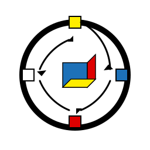

====================
Examples & Tutorials
====================

.. epigraph::

   "Show me the code!" 
   
   -- Linus Torvalds

Welcome to the WRT examples! Here you'll find practical, runnable code that shows you exactly how to use every part of the WebAssembly runtime. No dry theory, just working examples you can copy, paste, and adapt.

.. contents:: What's Inside
   :local:
   :depth: 2

Getting Started 🚀
------------------

New to WRT? Start here! These examples will get you up and running in minutes.

.. grid:: 2
   :gutter: 3

   .. grid-item-card:: Hello World
      :link: hello_world
      :link-type: doc

      Your first WebAssembly module with WRT - because every journey starts with "Hello!"

   .. grid-item-card:: Basic Component
      :link: basic_component
      :link-type: doc

      Create and run a simple WebAssembly component - it's easier than you think!

Foundation Library 🏗️
---------------------

The building blocks of safety-critical systems. These examples show you how to use WRT's core primitives that make embedded WebAssembly possible.

.. grid:: 2
   :gutter: 3

   .. grid-item-card:: Bounded Collections
      :link: foundation/bounded_collections
      :link-type: doc

      No allocations, no problems! Fixed-size collections that never panic.

   .. grid-item-card:: Safe Memory
      :link: foundation/safe_memory
      :link-type: doc

      Memory safety without the overhead - bounds checking that actually works.

   .. grid-item-card:: Atomic Memory
      :link: foundation/atomic_memory
      :link-type: doc

      Thread-safe operations for when you need to share (carefully).

   .. grid-item-card:: Sync Primitives
      :link: foundation/sync_primitives
      :link-type: doc

      Mutexes, RwLocks, and Once - concurrency made safe and simple.

   .. grid-item-card:: No-std HashMap
      :link: foundation/no_std_hashmap
      :link-type: doc

      Who says you need std for a HashMap? Not us!

   .. grid-item-card:: Component Values
      :link: foundation/component_values
      :link-type: doc

      Type-safe value handling across the WebAssembly boundary.

   .. grid-item-card:: Resource Management
      :link: foundation/resources
      :link-type: doc

      Handles, lifecycles, and why Rust makes this so much easier.

Platform Layer 🖥️
------------------

WRT adapts to your platform - from embedded RTOS to enterprise servers. These examples show platform-specific features and optimizations.

.. grid:: 2
   :gutter: 3

   .. grid-item-card:: Memory Management
      :link: platform/memory_management
      :link-type: doc

      Platform-specific memory strategies - mmap, guard pages, and more.

   .. grid-item-card:: Synchronization
      :link: platform/synchronization
      :link-type: doc

      From futexes to os_unfair_lock - the right primitive for each platform.

   .. grid-item-card:: Platform Detection
      :link: platform/platform_detection
      :link-type: doc

      Runtime feature detection and adaptive implementations.

   .. grid-item-card:: QNX Features
      :link: platform/qnx_features
      :link-type: doc

      Real-time, safety-critical features for QNX Neutrino.

   .. grid-item-card:: Linux Features
      :link: platform/linux_features
      :link-type: doc

      Advanced Linux capabilities - MTE, cgroups, and io_uring.

   .. grid-item-card:: macOS Features
      :link: platform/macos_features
      :link-type: doc

      Mach VM, GCD, and Apple Silicon optimizations.

   .. grid-item-card:: Embedded Platforms
      :link: platform/embedded_platforms
      :link-type: doc

      Zephyr, Tock, and bare-metal - WRT goes everywhere.

   .. grid-item-card:: Performance Optimizations
      :link: platform/performance_optimizations
      :link-type: doc

      Platform-specific tricks to squeeze out every cycle.

   .. grid-item-card:: Hardware Security
      :link: platform/hardware_security
      :link-type: doc

      PAC, MTE, CET - use hardware security features with WRT.

Core Runtime Examples 🎯
------------------------

The heart of WRT - see how the runtime actually executes WebAssembly modules.

.. grid:: 2
   :gutter: 3

   .. grid-item-card:: Bounded Engine
      :link: core/bounded_engine
      :link-type: doc

      Control memory and CPU usage - perfect for embedded systems.

   .. grid-item-card:: Checkpointing
      :link: core/checkpoint
      :link-type: doc

      Save and restore execution state - time travel for your code!

   .. grid-item-card:: CFI Protection
      :link: core/cfi_protection
      :link-type: doc

      Control Flow Integrity - because security matters.

   .. grid-item-card:: Memory Adapter
      :link: core/memory_adapter
      :link-type: doc

      Custom memory implementations for special requirements.

Component Model 🧩
------------------

The WebAssembly Component Model is the future - learn how to use it today.

.. grid:: 2
   :gutter: 3

   .. grid-item-card:: Component Info
      :link: component/info_simple
      :link-type: doc

      Inspect and understand component metadata.

   .. grid-item-card:: Interceptors
      :link: component/interceptor
      :link-type: doc

      Hook into component execution for monitoring and debugging.

   .. grid-item-card:: Type Conversion
      :link: component/type_conversion
      :link-type: doc

      Seamlessly convert between host and guest types.

   .. grid-item-card:: Component Builder
      :link: component/builder
      :link-type: doc

      Build components programmatically - it's like LEGO for code!

Host Integration 🔌
-------------------

Connect your WebAssembly modules to the outside world.

.. grid:: 2
   :gutter: 3

   .. grid-item-card:: Host Functions
      :link: host/functions
      :link-type: doc

      Let WebAssembly call your Rust functions.

   .. grid-item-card:: Callbacks
      :link: host/callbacks
      :link-type: doc

      When WebAssembly needs to call you back.

   .. grid-item-card:: Memory Sharing
      :link: host/memory
      :link-type: doc

      Share memory safely between host and guest.

Advanced Topics 🎓
------------------

Ready to level up? These examples show advanced techniques and optimizations.

.. grid:: 2
   :gutter: 3

   .. grid-item-card:: Debugging
      :link: advanced/debugging
      :link-type: doc

      Debug WebAssembly like a pro with WRT's debug features.

   .. grid-item-card:: Custom Decoders
      :link: advanced/decoder
      :link-type: doc

      Parse custom sections and extend WebAssembly.

   .. grid-item-card:: Performance Tuning
      :link: advanced/performance
      :link-type: doc

      Make it fast, then make it faster.

   .. grid-item-card:: Safety Patterns
      :link: advanced/safety
      :link-type: doc

      Safety-critical patterns for mission-critical code.

   .. grid-item-card:: MC/DC Testing
      :link: advanced/mcdc_testing
      :link-type: doc

      Modified Condition/Decision Coverage - because 100% matters.

Full Examples 🏆
----------------

Put it all together with complete, production-ready applications.

.. grid:: 1
   :gutter: 3

   .. grid-item-card:: Complete Application
      :link: full/application
      :link-type: doc

      A full application from start to finish - see how all the pieces fit together!

.. admonition:: Pro Tip
   :class: tip

   All examples in this documentation are tested in CI. If it's in the docs, it compiles and runs!

.. toctree::
   :hidden:
   :maxdepth: 2
   :caption: Examples

   hello_world
   basic_component
   foundation/index
   core/index
   component/index
   host/index
   advanced/index
   platform/index
   full/application