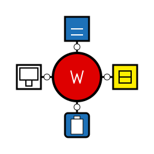

==========================
Platform Layer Examples
==========================

.. epigraph::

   "Write once, run anywhere? How about write once, run SAFELY anywhere!"
   
   -- Every embedded developer ever

The ``wrt-platform`` crate is your gateway to running WebAssembly across wildly different platforms - from tiny microcontrollers to massive servers, from real-time systems to secure enclaves. One API, many targets, zero compromises on safety.

What's Platform Abstraction? 🌍
--------------------------------

Picture this: You're writing a WebAssembly runtime that needs to work on:

- **Linux servers** with gigabytes of RAM
- **QNX systems** in cars with strict real-time requirements
- **VxWorks** in industrial automation and aerospace systems
- **Zephyr RTOS** on a microcontroller with 256KB of memory
- **macOS** development machines with funky VM subsystems
- **Tock OS** with hardware-enforced security boundaries

Same code. Different worlds. That's what ``wrt-platform`` makes possible.

.. contents:: Platform Examples
   :local:
   :depth: 2

.. toctree::
   :maxdepth: 1
   :caption: Examples in this section:

   memory_management
   synchronization
   platform_detection
   qnx_features
   linux_features
   macos_features
   embedded_platforms
   performance_optimizations
   hardware_security

The Platform Philosophy 🎯
--------------------------

**Zero-Cost Abstractions:**
   Platform-specific code compiles down to direct system calls. No runtime dispatch, no vtables, just pure performance.

**Paradigm-Based Design:**
   Different platforms have different philosophies. We embrace them:
   
   - **POSIX** → Dynamic, flexible, feature-rich
   - **Security-First** → Static, isolated, verified
   - **Real-Time** → Deterministic, predictable, fast
   - **Bare Metal** → Minimal, direct, efficient

**Graceful Degradation:**
   Missing a hardware feature? No problem. We detect and adapt at compile time.

Platform Feature Matrix 📊
--------------------------

.. list-table:: Platform Capabilities
   :header-rows: 1
   :widths: 20 15 15 15 15 20

   * - Platform
     - Memory Model
     - Sync Primitives
     - Real-Time
     - Security
     - Special Features
   * - Linux
     - mmap/mprotect
     - Futex
     - SCHED_FIFO
     - SELinux
     - ARM MTE, huge pages
   * - macOS
     - mach_vm
     - os_unfair_lock
     - Limited
     - Sandboxing
     - Hypervisor.framework
   * - QNX
     - Memory partitions
     - Native futex
     - Full POSIX RT
     - ASIL certified
     - Adaptive partitioning
   * - VxWorks
     - Memory partitions
     - Semaphores/MQ
     - Hard real-time
     - IEC 61508
     - LKM/RTP contexts
   * - Zephyr
     - k_mem_domain
     - k_sem/k_mutex
     - Hard real-time
     - MPU/MMU
     - Power management
   * - Tock
     - Grants/AppSlices
     - IPC-based
     - Cooperative
     - Process isolation
     - Capability-based
   * - Bare Metal
     - Static only
     - Spin locks
     - Depends
     - Minimal
     - Direct hardware

Quick Start Examples 🚀
-----------------------

**Auto-Platform Selection** (recommended for beginners):

.. code-block:: rust
   :caption: Let the platform layer choose for you

   use wrt_platform::prelude::*;
   use wrt_platform::platform_select;

   fn main() -> Result<(), wrt_error::Error> {
       // Automatically selects the best platform implementation
       let platform = platform_select::create_auto_platform();
       
       // Create memory allocator (compiles to platform-specific code)
       let allocator = platform.create_allocator()?;
       
       // Allocate some pages
       let (ptr, size) = allocator.allocate(16, Some(1024))?;
       println!("Allocated {} bytes at {:?}", size, ptr);
       
       Ok(())
   }

**Paradigm-Based Selection** (for specific requirements):

.. code-block:: rust
   :caption: Choose your platform philosophy

   use wrt_platform::prelude::*;
   use wrt_platform::{paradigm, UnifiedPlatform, PlatformConfig};

   // For real-time systems
   let rt_config = PlatformConfig::<paradigm::RealTime>::new()
       .with_max_pages(256)
       .with_rt_priority(10);
   let rt_platform = UnifiedPlatform::new(rt_config);

   // For security-critical systems  
   let secure_config = PlatformConfig::<paradigm::SecurityFirst>::new()
       .with_max_pages(128)
       .with_static_allocation(8 * 1024 * 1024)  // 8MB static buffer
       .with_isolation_level(IsolationLevel::Hardware);
   let secure_platform = UnifiedPlatform::new(secure_config);

Hardware Security Features 🔐
-----------------------------

Modern CPUs aren't just fast - they're secure. We leverage:

.. code-block:: rust
   :caption: Hardware security in action

   use wrt_platform::hardware_optimizations::{HardwareOptimizer, SecurityLevel};
   use wrt_platform::hardware_optimizations::arm::BranchTargetIdentification;

   // Enable ARM BTI for control-flow integrity
   let optimizer = HardwareOptimizer::new();
   if optimizer.has_feature::<BranchTargetIdentification>() {
       let bti = optimizer.enable_bti()?;
       bti.protect_memory(code_ptr, code_size)?;
       println!("BTI protection enabled!");
   }

   // Check security level
   match optimizer.security_level() {
       SecurityLevel::SecureExecution => {
           println!("Running in secure enclave");
       },
       SecurityLevel::Advanced => {
           println!("Hardware security features available");
       },
       _ => {
           println!("Basic security only");
       }
   }

Pick Your Platform Adventure 🗺️
--------------------------------

Where are you deploying?

- **Building for Linux?** → :doc:`linux_features`
- **Targeting automotive QNX?** → :doc:`qnx_features`
- **Industrial VxWorks deployment?** → :doc:`../platform_guides/vxworks`
- **Developing on macOS?** → :doc:`macos_features`
- **Embedded with Zephyr/Tock?** → :doc:`embedded_platforms`
- **Need memory tricks?** → :doc:`memory_management`
- **Concurrent code?** → :doc:`synchronization`
- **Performance critical?** → :doc:`performance_optimizations`
- **Security focused?** → :doc:`hardware_security`

.. admonition:: Pro Tip
   :class: tip

   Start with auto-platform selection and only specialize when you need specific features. The platform layer is smart enough to pick optimal implementations for most use cases.

Remember: Write your WebAssembly runtime once, and let ``wrt-platform`` handle the messy platform details. That's the power of proper abstraction!