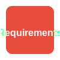

======================
Requirements Dashboard
======================

This section provides a consolidated view of all system requirements and their status. Use this dashboard to track implementation progress and relationships between different requirement types.

.. contents:: On this page
   :local:
   :depth: 2

Requirements Overview
---------------------

The following charts provide an overview of requirements status by category:

Functional Requirements
~~~~~~~~~~~~~~~~~~~~~~~

.. commenting out needpie directives until they can be fixed
..
.. .. needpie::
..    :labels: Implemented, Partial, Not Started
..    :filter: id =~ "REQ_[^S].*" and status != "removed"

Safety Requirements
~~~~~~~~~~~~~~~~~~~

.. commenting out needpie directives until they can be fixed
..
.. .. needpie::
..    :labels: Implemented, Partial, Not Started
..    :filter: id =~ "REQ_SAFETY.*|REQ_MEM_SAFETY.*|REQ_VERIFY.*|REQ_RESOURCE.*" and status != "removed"

Qualification Requirements
~~~~~~~~~~~~~~~~~~~~~~~~~~

.. commenting out needpie directives until they can be fixed
..
.. .. needpie::
..    :labels: Implemented, Partial, Not Started
..    :filter: id =~ "QUAL_.*" and status != "removed"

Implementation Status
---------------------

This table shows the implementation status of all requirements:

.. needtable::
   :columns: id;title;status;implementation_status
   :filter: id.startswith("REQ_") or id.startswith("QUAL_")
   :style: table

Traceability Matrix
-------------------

The following matrix shows the relationships between requirements, specifications, implementations, and tests:

.. needflow::
   :filter: id.startswith("REQ_") or id.startswith("SPEC_") or id.startswith("IMPL_") or id.startswith("T_")
   :show_legend:

Key Requirements
----------------

The following are the key requirements driving the SentryPulse Engine design:

.. needtable::
   :columns: id;title;status
   :filter: id in ['REQ_SAFETY_001', 'REQ_SAFETY_002', 'REQ_MEM_SAFETY_001', 'REQ_RESOURCE_001', 'REQ_WASM_001', 'REQ_CODE_QUALITY_001'] 