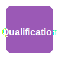

=======================
Standards Compliance
=======================

This section documents PulseEngine's compliance approach for safety standards including ISO 26262, IEC 61508, and IEC 62304.

.. warning::
   **Certification Status**: PulseEngine is NOT currently certified to any safety standard.
   This documentation supports preparation for future certification activities.

.. contents:: On this page
   :local:
   :depth: 2

Overview
========

Supported Standards
-------------------

PulseEngine architecture supports the following safety standards:

.. list-table:: Target Safety Standards
   :widths: 25 25 25 25
   :header-rows: 1

   * - Standard
     - Domain
     - Safety Level
     - Status
   * - ISO 26262:2018
     - Automotive
     - ASIL-D
     - Architecture ready
   * - IEC 61508:2010
     - Industrial
     - SIL 3
     - Architecture ready
   * - IEC 62304:2006
     - Medical
     - Class C
     - Architecture ready
   * - DO-178C
     - Aerospace
     - DAL-B
     - Planned

Compliance Strategy
-------------------

As a Safety Element out of Context (SEooC), PulseEngine follows:

1. **Generic Safety Requirements** - Not tied to specific application
2. **Conservative Assumptions** - Support highest safety levels
3. **Comprehensive Documentation** - Full lifecycle coverage
4. **Tool Qualification** - Development tool qualification data
5. **Evidence Package** - Complete certification evidence

Common Requirements
===================

Cross-Standard Requirements
---------------------------

All supported standards share common requirements:

.. list-table:: Common Safety Requirements
   :widths: 40 60
   :header-rows: 1

   * - Requirement Category
     - PulseEngine Approach
   * - **Functional Safety Management**
     - Safety plan, safety case, assessment process
   * - **Safety Requirements**
     - Comprehensive requirements with traceability
   * - **Architecture Design**
     - Modular architecture with safety mechanisms
   * - **Implementation**
     - Coding standards, static analysis, reviews
   * - **Verification**
     - Multi-level testing, formal verification
   * - **Validation**
     - Use case validation, field feedback
   * - **Configuration Management**
     - Version control, change management
   * - **Documentation**
     - Complete lifecycle documentation

Safety Integrity Levels
-----------------------

Mapping between different standards:

.. list-table:: Safety Level Mapping
   :widths: 25 25 25 25
   :header-rows: 1

   * - ISO 26262
     - IEC 61508
     - IEC 62304
     - Criticality
   * - ASIL-D
     - SIL 3
     - Class C
     - Highest
   * - ASIL-C
     - SIL 2
     - Class B
     - High
   * - ASIL-B
     - SIL 1
     - Class B
     - Medium
   * - ASIL-A
     - SIL 1
     - Class A
     - Low
   * - QM
     - -
     - -
     - None

Compliance Documents
====================

Required Documents
------------------

For certification, the following documents are required:

1. **Safety Manual** (this document)
2. **Safety Case** - Arguments and evidence
3. **Validation Report** - Testing evidence
4. **Qualification Report** - Tool qualification
5. **Assessment Report** - Independent assessment

Available Documents
-------------------

Currently available:

- ✅ Safety Manual (in development)
- ✅ Requirements Specification
- ✅ Architecture Documentation
- ✅ Verification Plans
- ⚠️ Safety Case (partial)
- ❌ Assessment Reports (requires assessor)

Compliance Status
=================

Current Status
--------------

.. list-table:: Compliance Readiness
   :widths: 30 20 50
   :header-rows: 1

   * - Standard Requirement
     - Status
     - Notes
   * - Safety Management
     - ✅ Ready
     - Processes defined
   * - Requirements
     - ✅ Ready
     - Traceable requirements
   * - Architecture
     - ✅ Ready
     - Safety mechanisms implemented
   * - Implementation
     - 🚧 Partial
     - Core execution engine in development
   * - Verification
     - 🚧 Partial
     - Test framework ready, coverage growing
   * - Tool Qualification
     - 🚧 Partial
     - Rust toolchain qualification needed
   * - Documentation
     - 🚧 Partial
     - Safety manual in development

Gap Analysis
------------

Major gaps for certification:

1. **Implementation Completion** - Core execution engine
2. **Test Coverage** - Need >90% coverage for ASIL-D
3. **Tool Qualification** - Rust compiler qualification
4. **Independent Assessment** - Third-party review
5. **Field Experience** - Deployment evidence

Compliance Activities
=====================

Development Phase
-----------------

During development:

- Follow coding standards
- Perform safety analyses
- Implement safety mechanisms
- Create verification evidence
- Maintain traceability

Integration Phase
-----------------

For system integrators:

- Verify assumptions (see :doc:`../assumptions`)
- Validate in target environment
- Perform system-level safety analysis
- Create integration safety case
- Obtain assessment

Maintenance Phase
-----------------

Ongoing compliance:

- Monitor field issues
- Update safety analyses
- Maintain verification
- Manage changes safely
- Periodic reassessment

Tool Qualification
==================

Development Tools
-----------------

Tools requiring qualification:

.. list-table:: Tool Qualification Status
   :widths: 30 20 20 30
   :header-rows: 1

   * - Tool
     - Classification
     - TCL
     - Status
   * - Rust Compiler
     - T3
     - TCL3
     - Ferrocene available
   * - KANI Verifier
     - T2
     - TCL2
     - Qualification needed
   * - Test Framework
     - T1
     - TCL1
     - Evidence available

Qualification Approach
----------------------

1. **Tool Classification** - Determine impact on safety
2. **Confidence Building** - Testing, validation, experience
3. **Qualification Evidence** - Documentation package
4. **Tool Validation** - Ongoing verification

Standard-Specific Information
=============================

Detailed compliance information for each standard:

.. toctree::
   :maxdepth: 1

   iso26262
   iec61508
   traceability

Certification Roadmap
=====================

Path to Certification
---------------------

1. **Implementation in Progress** (Current phase)
   - Finish core execution engine
   - Achieve target test coverage
   
2. **Tool Qualification**
   - Qualify Rust toolchain (Ferrocene)
   - Validate verification tools
   
3. **Evidence Completion**
   - Complete safety case
   - Finalize documentation
   
4. **Pre-Assessment**
   - Internal assessment
   - Gap remediation
   
5. **Formal Assessment**
   - Select certification body
   - Undergo assessment
   
6. **Certification**
   - Address findings
   - Obtain certificate

Timeline Estimate
-----------------

From current state:

- Implementation completion: 6-12 months
- Evidence preparation: 3-6 months  
- Assessment process: 3-6 months
- **Total: 12-24 months** to first certification

Resources
=========

Standards Documents
-------------------

- ISO 26262:2018 (all parts)
- IEC 61508:2010 (parts 1-7)
- IEC 62304:2006+A1:2015

Industry Guidance
-----------------

- MISRA C guidelines
- AUTOSAR safety guidelines
- SEooC development guides

Certification Bodies
--------------------

Recognized assessors:

- TÜV SÜD
- TÜV Rheinland  
- SGS
- Bureau Veritas
- DNV

Next Steps
==========

For certification preparation:

1. Review :doc:`../requirements` against your standard
2. Verify :doc:`../mechanisms` meet standard requirements
3. Check :doc:`traceability` for requirement coverage
4. Ensure :doc:`../assumptions` are documented
5. Prepare system-specific safety case